# Muhammad Essa-5215 - Student Attendance Management System


Muhammad Essa is a cross-platform mobile application built using **Flutter** and **Firebase**, designed to help teachers manage student attendance efficiently. Initially developed for the **BSCS section A** at **Karakoram international university gilgit** under the guidance of **[Prof Mushaid Hussain]**, this app aims to streamline academic attendance management through a simple and scalable system.

---

**Muhammad Essa** is a mobile application designed for managing student attendance in educational institutions. It supports teachers' login and offers features for attendance tracking. Built with Flutter and Firebase, this system helps streamline attendance management.

## Features

- **Teacher Role**:
    - Mark attendance for students
    - Track attendance statistics for courses
- **Attendance summary charts**
- **CSV/PDF export of attendance data**

### Future Features
- Department Head Role
- Course Advisor Role
- Student Role
- Open for all Departments

## App Preview

Here is a preview of the main screens and features of the Muhammad Essa application.

| Login | Teacher Dashboard | Student Dashboard | Take Attendance | Generate Reports |
|:---:|:---:|:---:|:---:|:---:|
| 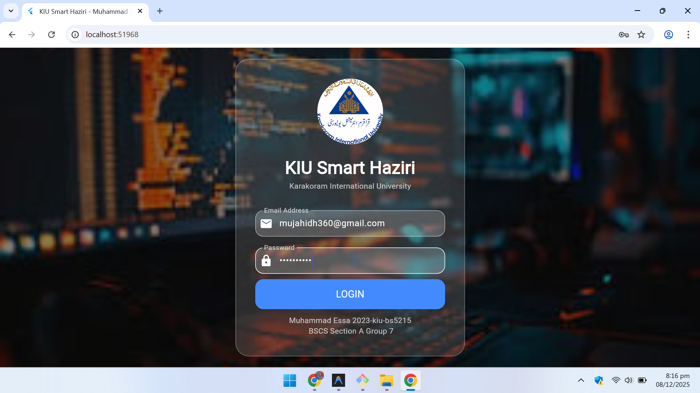 | 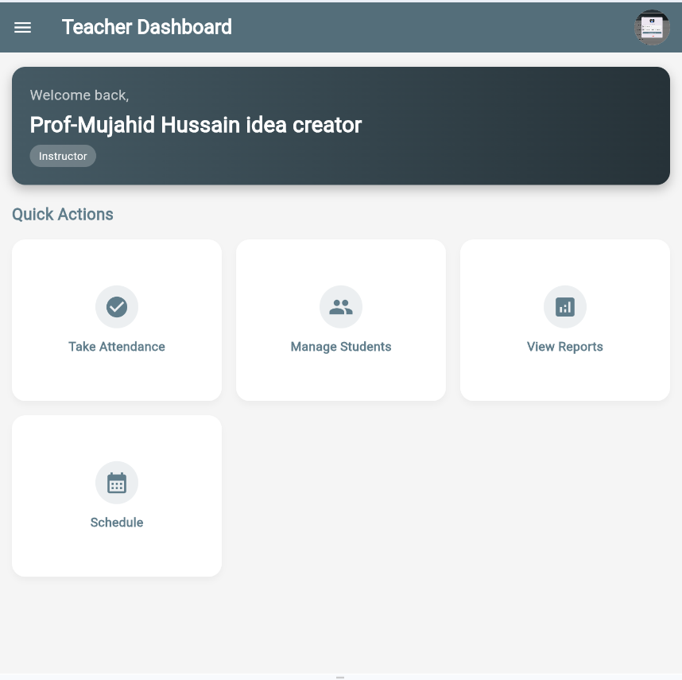 | 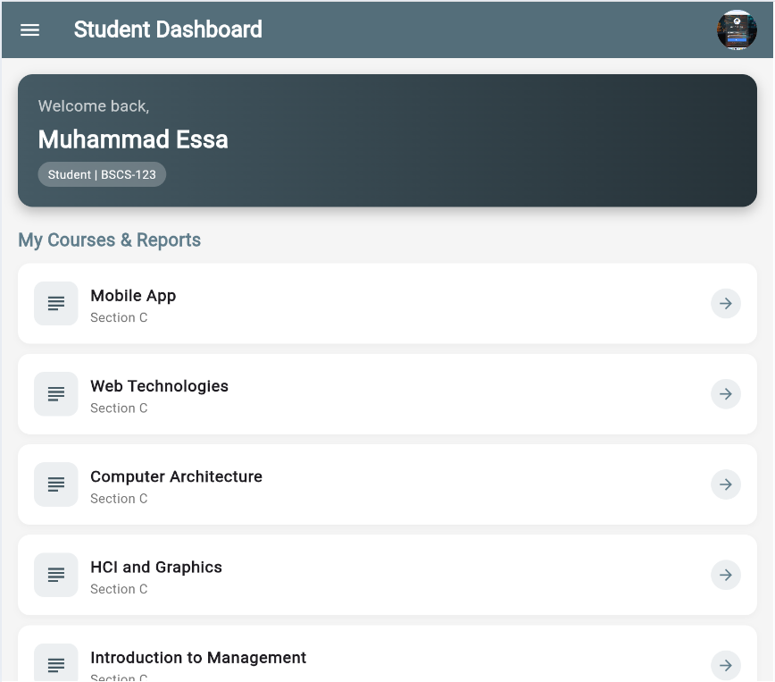 | 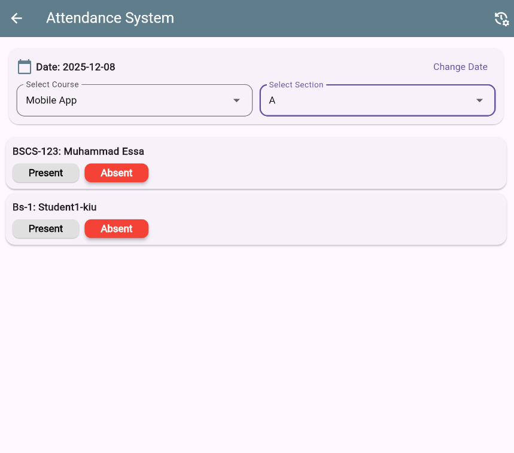 | 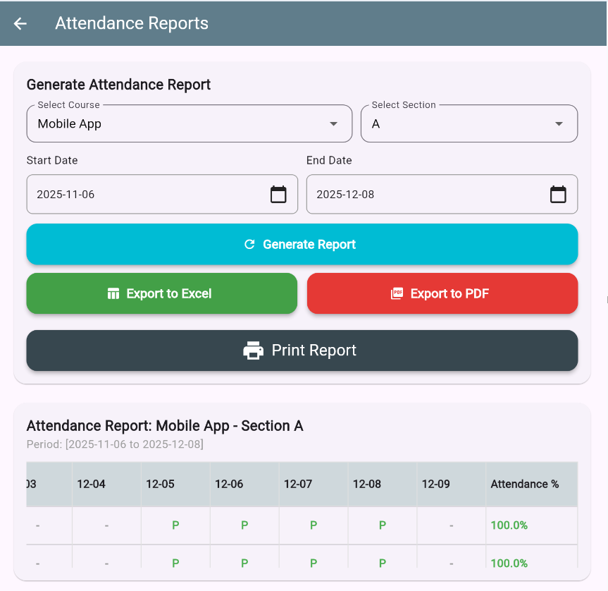 |
| **Teacher Drawer** | **Student Drawer** | **Manage Student** | **Edit profile** | **Password change** |
| 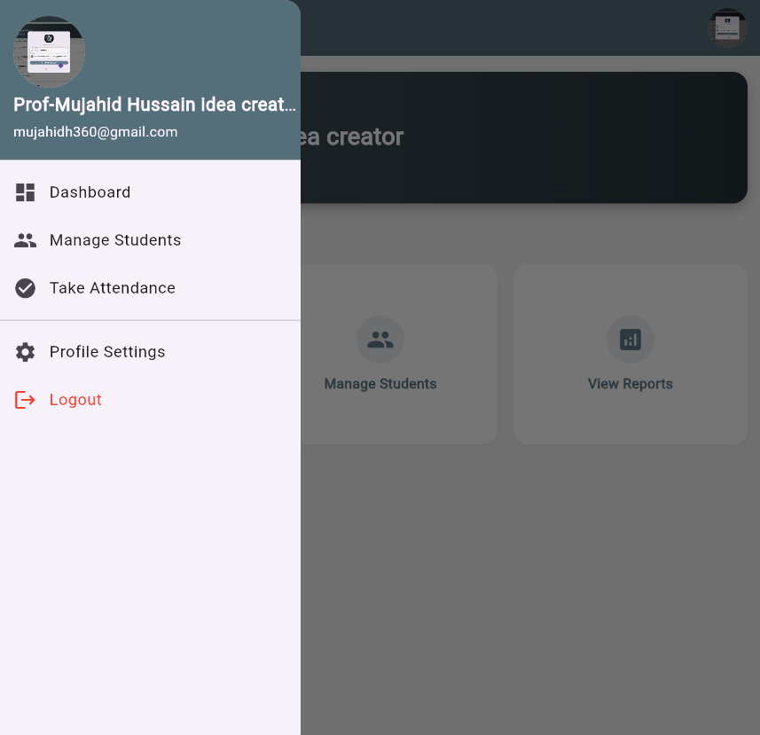 | 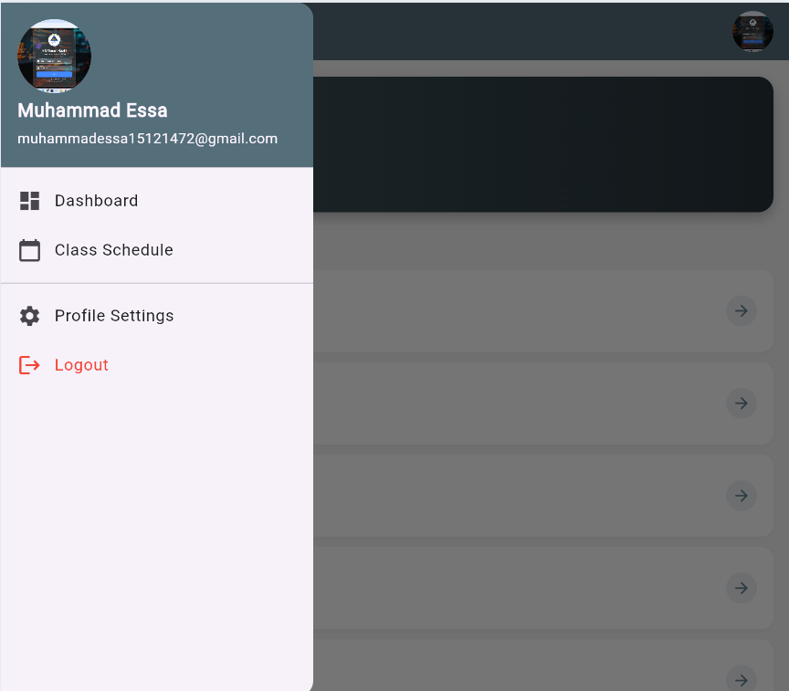 | 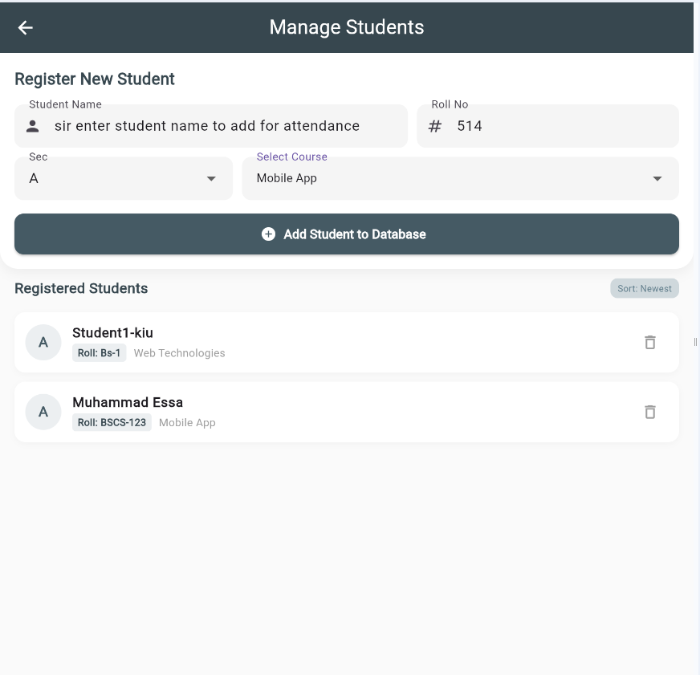 | 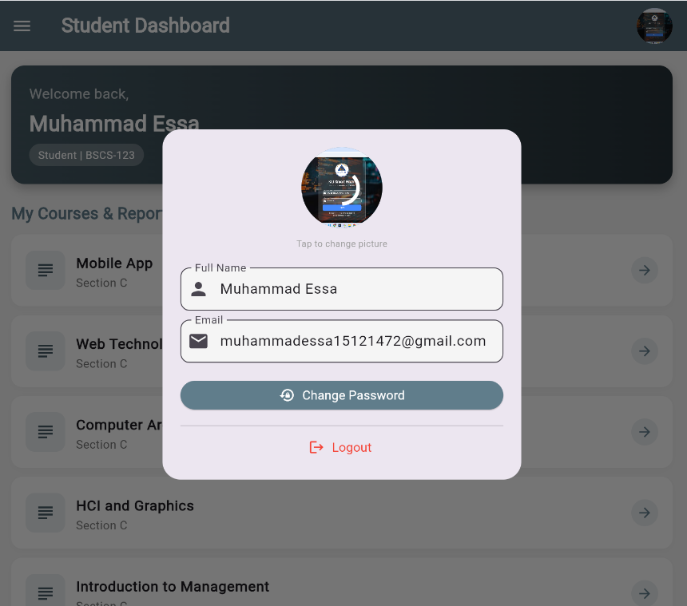 | 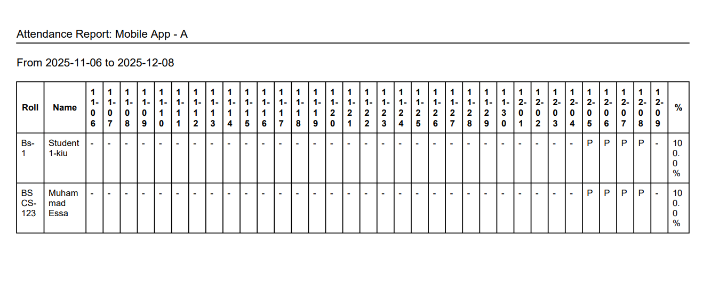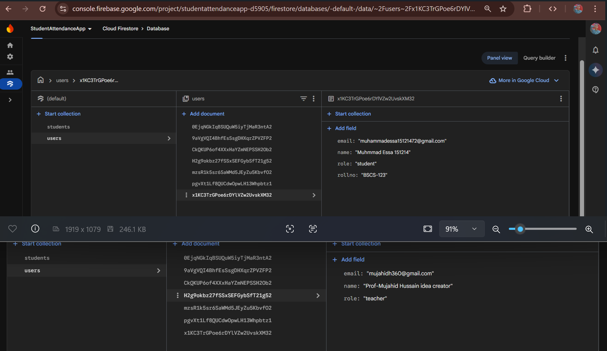 |


## Tech Stack

- **Flutter** — Cross-platform mobile development
- **Dart** — Programming language
- **Firebase Authentication** — User sign-up and login management
- **Firebase Firestore** — NoSQL cloud database for storing attendance data
- **shared_preferences** — Local key-value storage
- **image_picker** — Select images from gallery or camera
- **pdf** — Generate and export attendance reports as PDFs
- **excel** — Export attendance data in Excel format
- **open_file** — Open exported files from the app
- **path_provider** — Access device file system paths
- **flutter_launcher_icons** — Generate app icons for Android and iOS
- **flutter_test** — Testing framework
- **flutter_lints** — Enforce code quality standards

## Getting Started

### Prerequisites
- [Flutter](https://flutter.dev/docs/get-started/install)
- Firebase account and project setup
- Android Studio or Xcode for emulator/device testing

### Installation

```bash

# Install dependencies
flutter pub get
```

### Configure Firebase

To connect the app to your Firebase project:

1. Go to the [Firebase Console](https://console.firebase.google.com/) and create a new project
2. Add an **Android** app and/or an **iOS** app in your project settings
3. Download the `google-services.json` file and place it inside the `android/app/` directory
4. Download the `GoogleService-Info.plist` file and place it inside the `ios/Runner/` directory
5. Make sure to enable required Firebase services like **Authentication** and **Firestore Database**

> For detailed setup instructions, refer to the official [FlutterFire documentation](https://firebase.flutter.dev/docs/overview)

### Run the App

Once everything is set up, start the app on your connected device or emulator:

```bash
flutter run
```

## Contributing

If you'd like to contribute:

1. **Fork** the repository
2. **Create a new branch**:
   ```bash
   git checkout -b feature-branch
   ```
3. **Commit** your changes:
   ```bash
   git commit -m "Add: new feature"
   ```
4. **Push** to your branch:
   ```bash
   git push origin feature-branch
   ```
5. Create a **Pull Request**

## License

This project is licensed under the **MIT License**.  
See the [LICENSE](LICENSE) file for more details.

## Acknowledgments

- Thanks to **Flutter** for the awesome UI framework
- Thanks to **Firebase** for providing scalable backend services
- Special thanks to **[Prof.Mujahid Hussain](https://muhammadessa-514.github.io/My-Personal-Portfolio/)** sir for guidance and supervision

## Contact

**[Muhammad Essa](www.linkedin.com/in/muhammadessa514)**

**ID: 2023-kiu-Bs5215**

**[BSCS & Sec A @ KIU](https://www.kiu.edu.pk/)**

**Email**: [muhammadessa1514@gmail.com](mailto:muhammadessa1514@gmail.com), [mujahidh360@gmail.com](mailto:mujahidh360@gmail.com)
